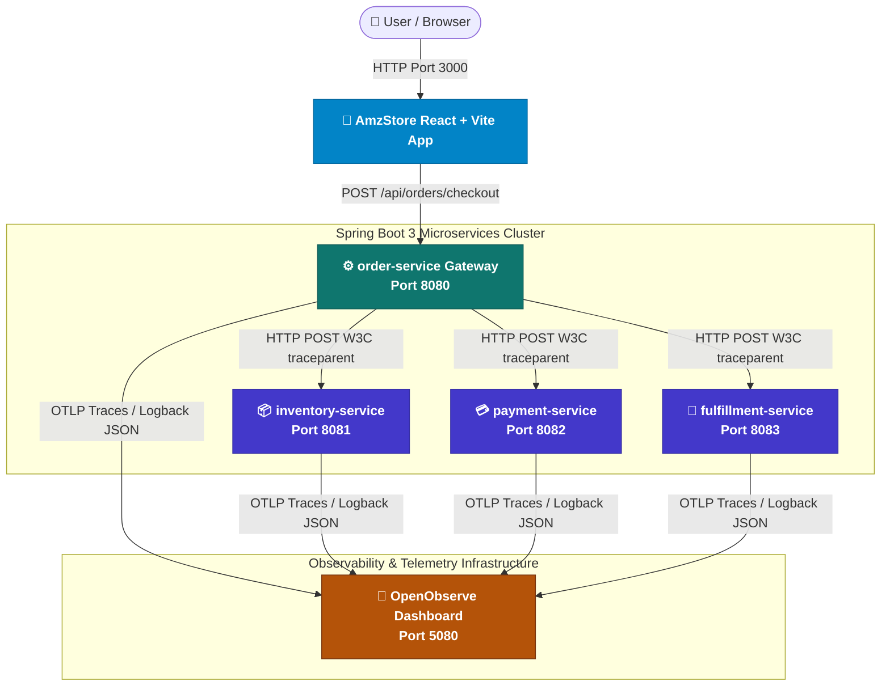
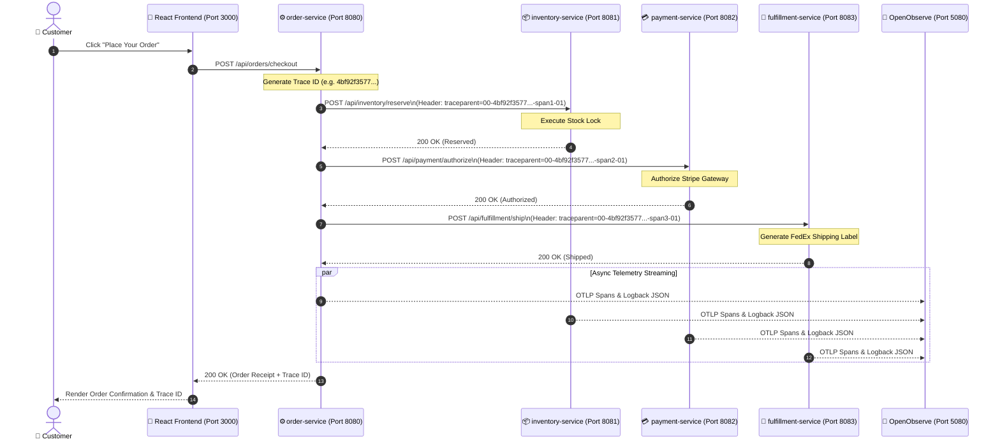

# OpenObserve & Spring Boot 3 Microservices Architecture Specification

This document provides a comprehensive technical overview of the **AmzStore Multi-Service Telemetry System**. It details the distributed microservices architecture, network communication paths, OpenTelemetry W3C tracecontext propagation, and real-time log ingestion pipeline into OpenObserve.

---

## 📐 System Architecture Diagram



---

## ⏱️ Distributed Tracing Sequence Diagram (W3C Context Propagation)

The sequence diagram below demonstrates how a single checkout click propagates a unified **Trace ID** across all 4 independent microservices using OpenTelemetry `traceparent` headers:



---

## 📡 Microservice Specification & Port Matrix

| Service Name | Port | Base Directory | Description | Trace Resource Attribute (`service.name`) |
| :--- | :--- | :--- | :--- | :--- |
| **AmzStore Frontend** | `3000` | `frontend/` | React + Vite UI with Amazon checkout flow & failure simulators | N/A (Browser Client) |
| **`order-service`** | `8080` | `backend/` | Order API Gateway, Cart Manager, and Pipeline Coordinator | `order-service` |
| **`inventory-service`**| `8081` | `services/inventory-service` | Stock reservation and DB row lock timeout failure simulator | `inventory-service` |
| **`payment-service`** | `8082` | `services/payment-service` | Stripe payment processor and card decline (402) simulator | `payment-service` |
| **`fulfillment-service`**| `8083` | `services/fulfillment-service` | FedEx shipping label generator and carrier API timeout (503) simulator | `fulfillment-service` |
| **OpenObserve UI** | `5080` | Docker Container | Centralized Observability Engine (Logs, Traces, Metrics) | `default` Stream / `default` Org |

---

## ⚙️ Log & Trace Ingestion Pipeline Architecture

```mermaid
flowcard
subgraph Microservice Application
    SLF4J[SLF4J Logger] --> Logback[Logback Framework]
    Micrometer[Micrometer Tracing] --> OTel[OpenTelemetry SDK]
end

subgraph Log Ingestion Engine
    Logback --> Appender[OpenObserveLogbackAppender]
    Appender --> Queue[ConcurrentLinkedQueue]
    Queue -->|Scheduled 1s Batch| HTTPLog[POST http://localhost:5080/api/default/default/_json]
end

subgraph Trace Ingestion Engine
    OTel --> OTLPExporter[OTLP Protobuf/HTTP Exporter]
    OTLPExporter --> HTTPTrace[POST http://localhost:5080/api/default/v1/traces]
end

HTTPLog --> OpenObserve[OpenObserve Storage Engine]
HTTPTrace --> OpenObserve
```

---

## 📄 File Deliverables
- **PNG Diagram**: [`architecture_diagram.png`](file:///c:/Users/abhishek%20dhiman/Desktop/OpenObserve/architecture_diagram.png)
- **Markdown Specification**: [`ARCHITECTURE.md`](file:///c:/Users/abhishek%20dhiman/Desktop/OpenObserve/ARCHITECTURE.md)
